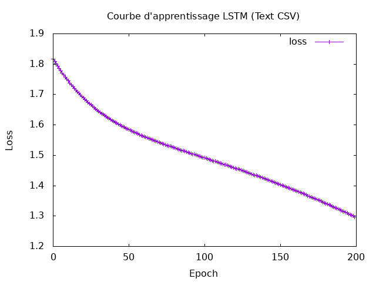
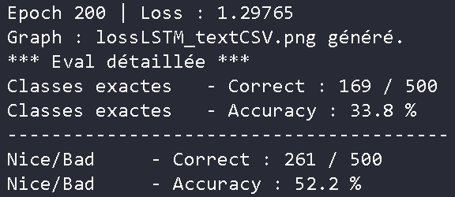
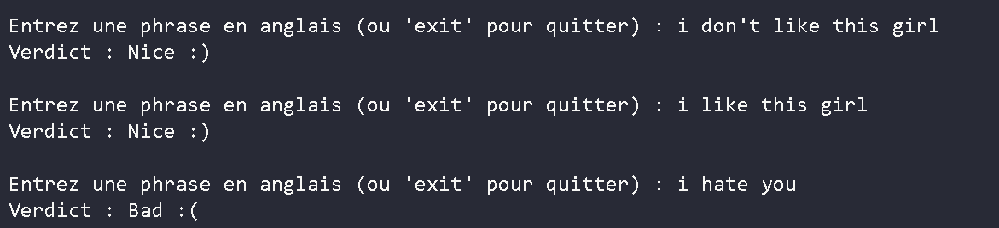

### Final Session

I choosed to implement LSTM, and to create an interface where you say soething, and the model tell if you're a good or a bad person. 

I trained on the Sentiment dataset, starting with 500 words on the training.
The dataset is from : https://huggingface.co/datasets/dair-ai/emotion/tree/main/split
The data were originally in parquet, but i made them into csv, to make the analyze easier. 
The loss curve isn't really beautiful, but the results where goods, so i choosed not to train on more epoch, because i knew i wanted to do it on more data after. 



I trained on 200 epoch, with a learning rate at 0.1. Also, i trained on those values first :
```
hidden layer : 128
word dimention : 500
```

And i got those results : 



The accuracy is different between the exacts classes and the nice/bad, because the dataset is divided on 6 emotions : 
```
0 sadness
1 joy
2 love
3 anger
4 fear
5 surprise
```
But i decided to create 2 classes : Good and Bad, Good being messages of joy and love, and bad messages of sadness, anger and fear. So if the model predict a 1 into a 3, it's false if we look classes by classes, but true if we only look at the model that i created. 

We got a 50% accuracy, that can be higher if we train on bigger dataset, and with more hidden dimensions.

I saved the results, and created an interface where you can write a sentece, and the model use the trained data to tell you if you are a bad or a good person : 



But it fails sometimes, due to the 50% accuracy, and the fact that sometimes, the words aren't known so the model don't know how to interpret it. 