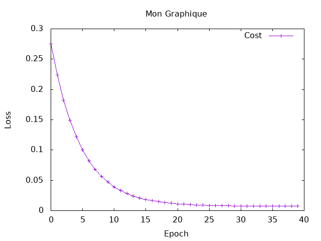

# Internship at Bekki's lab in Ochanomizu University
10/04/2026 ~ 15/06/2026

# Introduction to Neural Language Processing using hasktorch

In this internship, the main goal is to focus on the functionment of AI, and of neurons systems. 

# Session 3 Report : 

Resultst :
Cost : Tensor Float []  558.6971   
New A : Tensor Float []  0.5553
New B : Tensor Float []  94.5845

Talking with Swann, we hesitated to normalize the values

I choosed to analyze the GRE Scores ( out of 340 )

The exercice wasn't really hard, i just struggled with the g/h to understand what i had to do. But at the moment i understood, it wasn't hard to make it work. 
The main problem i eccounter was the errors, that aren't readable in haskell. 

predict graph : 

real graph : 

We can see that the prediction is really close to the reality. 
As we can see, the predicted values are almost the same are real ones, and the cost is really low, showing that our model work very well. 
