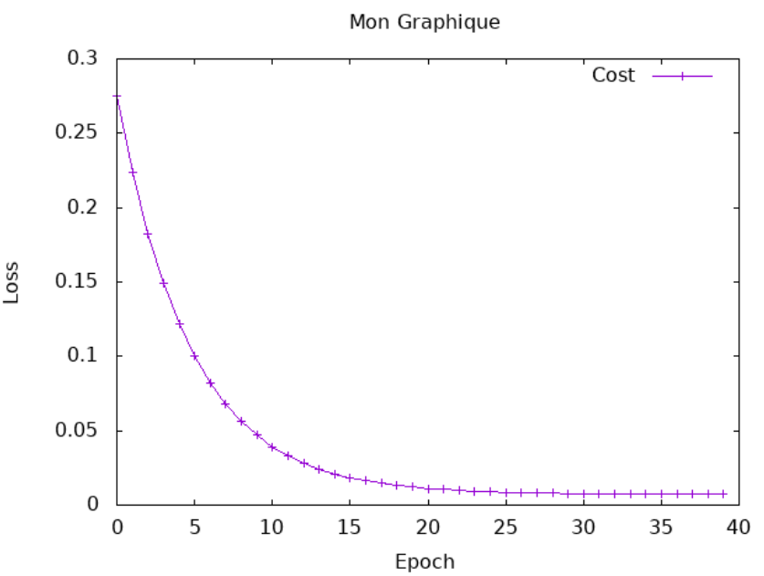
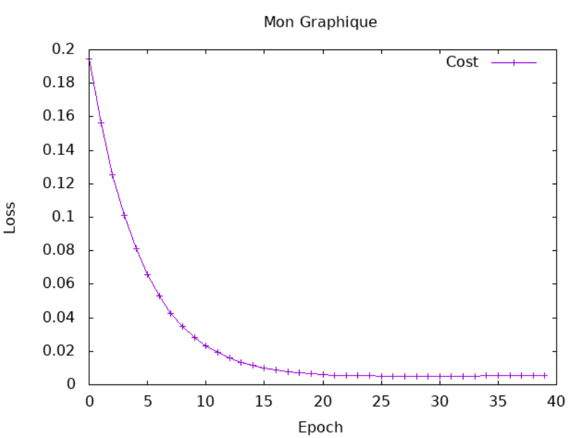

# Internship at Bekki's lab in Ochanomizu University
10/04/2026 ~ 15/06/2026

# Introduction to Neural Language Processing using hasktorch

In this internship, the main goal is to focus on the functionment of AI, and of neurons systems. 

# Session 3 Report : 

Resultst :
Cost : Tensor Float []  558.6971   
New A : Tensor Float []  0.5553
New B : Tensor Float []  94.5845

While talking with Swann, we hesitated to normalize the values. 

## Prediction part : 

I choosed to analyze the GRE Scores ( out of 340 ) for this part. 

The exercice wasn't really hard, i just struggled with the g/h questions to understand what i had to do. But at the moment i understood, it wasn't hard to make it work, i found the haskell language really intuitive. 
The main problem i eccounter was the errors, that aren't readable in haskell. But when i had the same multiple times, i understood what i had to do to get rid of it.  

For the results, i used 40 epoch, and 2 alphas for the two variables : 
alphA = 0.000001
alphB = 0.00005
This gaves me a final cost of 7.3586e-3 for the training, and New A : 2.2731e-3 and New B : 3.5184e-4. 
With them, i calculated the cost of the validation graph, and the prediction of the values. 
When we look at the predictions, and the real results, we can see if our model works well or not : 

### predict graph : 

### real graph : 

We can see that the prediction is really close to the reality. 
As we can see, the predicted values are almost the same are real ones, and the cost is really low, showing that our model work very well, and tehre is no over fitting (because of the differents costs).
I also struggled in the beggining with the graphs, but i asked for help, and now i understand it well. 

Also, looking at swan's code, i think i don't use haskell at it's full potential right now, so i will try to iprove on this point, to write a more readable code, respectiong Haskell. 
