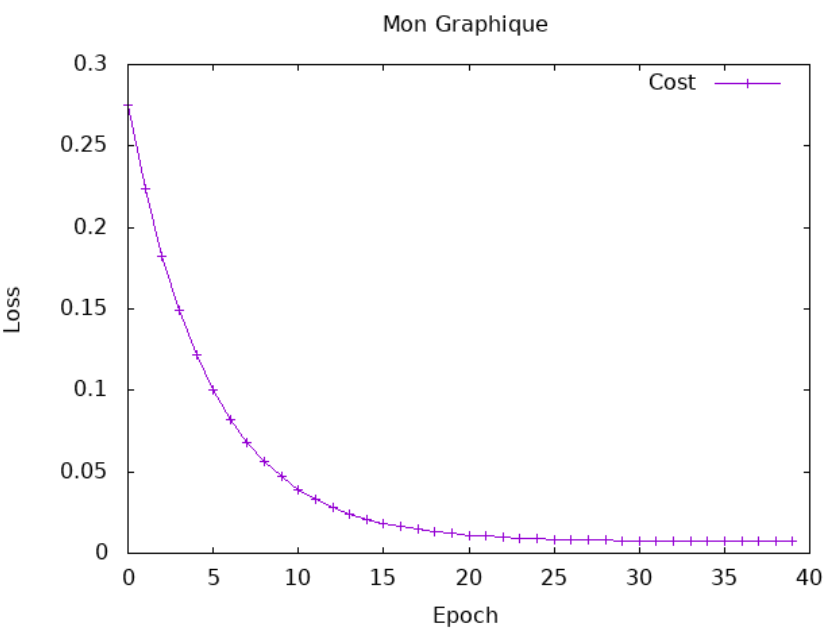
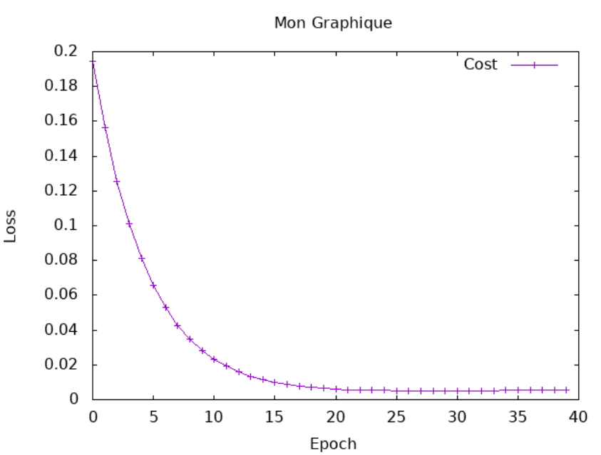
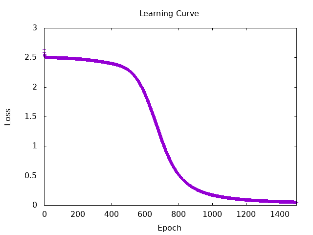
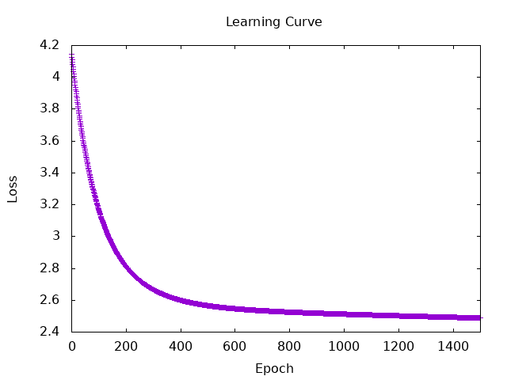
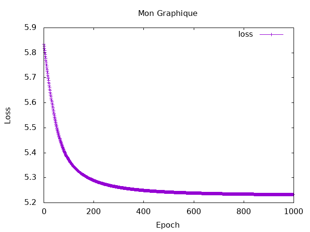

# Internship at Bekki's lab in Ochanomizu University
10/04/2026 ~ 15/06/2026

# Introduction to Neural Language Processing using hasktorch

In this internship, the main goal is to focus on the functionment of AI, and of neurons systems. 

# Session 3 Report : 

Resultst :
Cost : Tensor Float []  558.6971   
New A : Tensor Float []  0.5553
New B : Tensor Float []  94.5845

While talking with Swann, we hesitated to normalize the values. 

## Prediction part : 

I choosed to analyze the GRE Scores ( out of 340 ) for this part. 

The exercice wasn't really hard, i just struggled with the g/h questions to understand what i had to do. But at the moment i understood, it wasn't hard to make it work, i found the haskell language really intuitive. 
The main problem i eccounter was the errors, that aren't readable in haskell. But when i had the same multiple times, i understood what i had to do to get rid of it.  

For the results, i used 40 epoch, and 2 alphas for the two variables : 
alphA = 0.000001
alphB = 0.00005
This gaves me a final cost of 7.3586e-3 for the training, and New A : 2.2731e-3 and New B : 3.5184e-4. 
With them, i calculated the cost of the validation graph, and the prediction of the values. 
When we look at the predictions, and the real results, we can see if our model works well or not : 

### predict graph : 

### real graph : 

We can see that the prediction is really close to the reality. 
As we can see, the predicted values are almost the same are real ones, and the cost is really low, showing that our model work very well, and tehre is no over fitting (because of the differents costs).
I also struggled in the beggining with the graphs, but i asked for help, and now i understand it well. 

Also, looking at swan's code, i think i don't use haskell at it's full potential right now, so i will try to iprove on this point, to write a more readable code, respectiong Haskell. 

OVERHEATING / il remonde a droite en bas :(

# Session 4 :

## Xor explanations

I commented the xor code for better understanding.

But basically, it create a "model", with what we need in the code, and instance it. 
After, it use this model to train on 2000 steps, and compare the result to an existing, and simplier version of it, to make sure it work properly. 

The second one use a function already existing for activation, and some torch tools, that the first one implement alone. But it also use more hiden neurons to work. 

## Comparation

the sigmoid : it return a float, between 0 and 1, that need to be explained (if res > 0.5 == 1, and if res < 0.5 == 0).
Learning rate :  0.001

##### Sigmoid graph : 

the tanhFunc : as the sigmoid, it returns a float. But the interpretation is the same. He can also be negative, but sigmoid can't. And Sigmoid need a lot more learning, with a smaller learning rate than tanh. So that make tanh slower faster, but also working less precisely, and with more loss. 
Learning rate : 0.09

##### Tanh graph : 

# Session 5 

## results : 

TN : 1
FP : 5
FN : 0
TP : 33
precicsion  : 0.8684211
recall  : 1.0
accuracy  : 0.92957747

We can see that our model predicted 33 true positives, 5 fake posities and one true negative. That leads us to a precision of 0.8, and that mean that we got 80% of the people we predicted admitted were really admitted. We have a 1 recall, that means that we predicted all the people that were really admitted. And 92% of our predictions were right over all, meaning our model is quite precise. 

## Definition and use of survey on loss

##### negative log entropy :
She calculate the probability of the model being right. 

##### Cross-Entropy : 
calculate the cost of the prediction, but remembering the reality. 

##### KL divergence :
she medure the difference between chat we got and what we expected. 

# Session 6

after one training, and searching for  the word "love" : 

##### Loss graph : 

Tensor Float [1,9] [[-3.9167e-6, -3.1011e-6,  9.9972e-7,  2.2853e-6,  1.0000   ,  2.5378e-6,  1.9379e-7, -4.4165e-6, -1.0674e-8]]

After evaluating our model : 
NB same : 52 / 254
Accuracy : 20.47244 %

report : problemes/solutions, graphs, matrices, questions,...